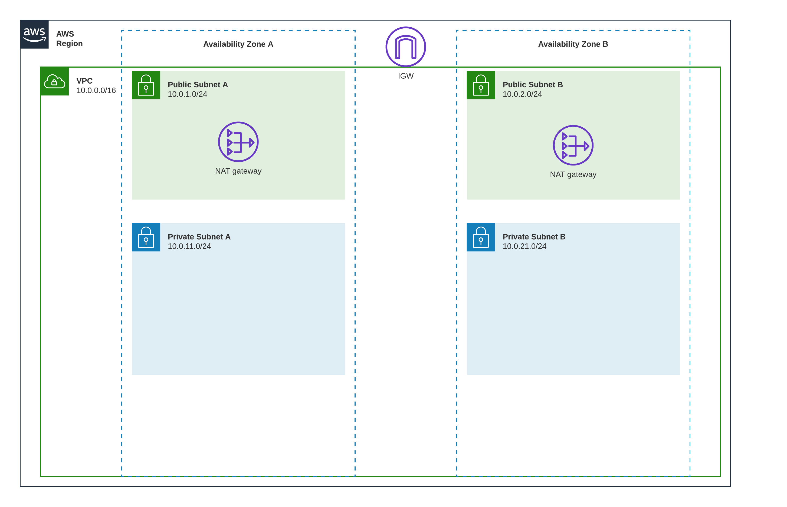
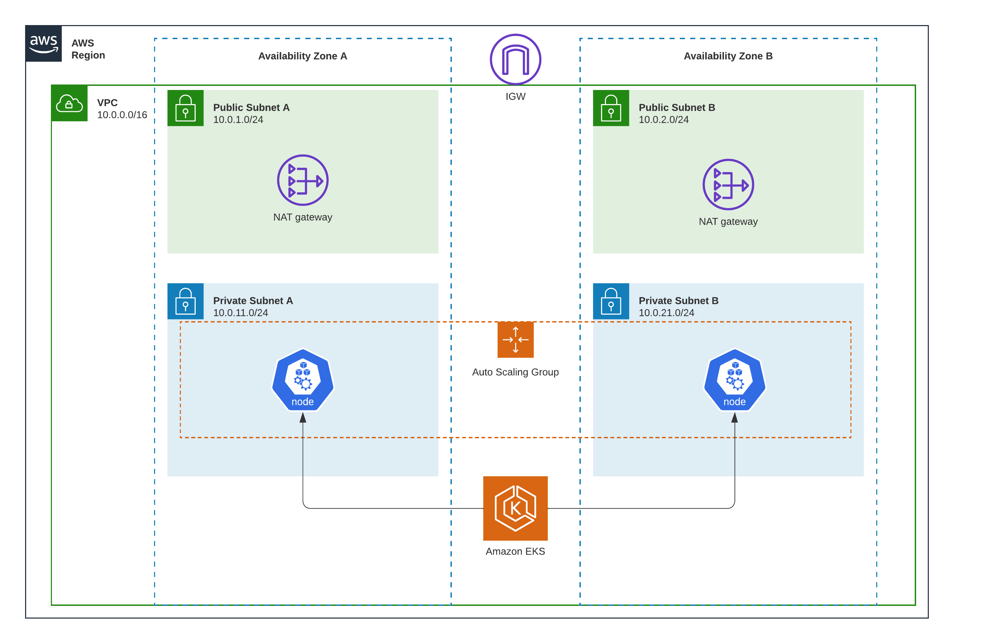

# Deploying Simple Node.js http server to EKS
This is a simple Node.js http server that is deployed to EKS using AWS Developer Tools, all IAC related code will be done using Terraform.

# Used tools
- Bash ([Git Bash](https://git-scm.com/))
- Make ([GNU Make](https://www.gnu.org/software/make/))
- [AWS CLI](https://docs.aws.amazon.com/cli/latest/userguide/getting-started-install.html)
- [Node.js v18.12.1](https://nodejs.org/en/download/)
- [Docker](https://docs.docker.com/engine/install/)
- [Terraform](https://developer.hashicorp.com/terraform/downloads)

# Prepare the Node.js http server app

## Initialize Node.js http sample

In order to start, we need to develop a sample Node.js http server app.
we will use `express` to create an api server with `/live` endpoint which is able to connect to MySql database, this app requires some environment variables:
- `PORT` => the port that the app will listen to
- `MYSQL_HOST` => MySQL host
- `MYSQL_PORT` => MySQL port
- `MYSQL_USER` => MySQL user name
- `MYSQL_PASSWORD` => MySQL user password
- `MYSQL_DATABASE` => MySQL initialized database name
- `NODE_ENV` => the environment that the app is running in
- `NODE_CONFIG` => the configuration files directory (required by the app)

You can test the application locally by running the following commands (bash), replace configurations with your own values:
```bash
cd simple-nodejs-http-server
export PORT=xxxx
export MYSQL_HOST=xxxxx
export MYSQL_PORT=xxxxx
export MYSQL_USER=xxxxx
export MYSQL_PASSWORD=xxxxx
export MYSQL_DATABASE=xxxxx
export NODE_ENV=development
export NODE_CONFIG_DIR="./src/config/environments"
# Install dependencies
npm install
# Start the app
npm start
```

## Test `/live` endpoint
To test the endpoint, you can run the following command:
```bash
curl -i http://localhost:xxxx/live

# You should get "Well done" as a response in case of the connection is established successfully
HTTP/1.1 200 OK
X-Powered-By: Express
Access-Control-Allow-Origin: *
Content-Type: text/html; charset=utf-8
Content-Length: 10
ETag: W/"a-aCSOYmhOcIfi3+KxyG3GkXE5PzQ"
Date: Sat, 19 Nov 2022 15:12:08 GMT
Connection: keep-alive
Keep-Alive: timeout=5
'Well done'

# Or you should get "Maintenance" as a response in case of the connection is not established successfully or disconnected
HTTP/1.1 503 Service Unavailable
X-Powered-By: Express
Access-Control-Allow-Origin: *
Content-Type: text/html; charset=utf-8
Content-Length: 12
ETag: W/"c-m7L8AAXJBYoBYRsT+3Nbzq9TAZI"
Date: Sat, 19 Nov 2022 15:15:07 GMT
Connection: keep-alive
Keep-Alive: timeout=5
'Maintenance'
```
You can view code changes in this [commit](https://github.com/BespinGlobalMEA/cloud-devops-engineer-hiring---bespinglobal-mea-raaedserag/commit/f353c98f323dbc0ca2bd07b1506ae0f5f65c9702)

## Add Simple Unit Tests
Now, let's add some simple unit tests in order to simulate the real world scenario, in order to do this we will use [Jest](https://jestjs.io/) as a test runner.

So the final `package.json` script section will look like this:
```json
"scripts": {
    "start": "node src/index.js",
    "test": "NODE_OPTIONS=--experimental-vm-modules npx jest"
},
```

You can view code changes in this [commit](https://github.com/BespinGlobalMEA/cloud-devops-engineer-hiring---bespinglobal-mea-raaedserag/commit/7a1292854cce451df4f296fde279d79b2a32d316)


## Dockerize the app
Now, let's dockerize the app, in order to do this we will use the following `Dockerfile`:
```dockerfile
FROM node:18.12.1-alpine
WORKDIR /usr/http-app

ARG dynamic_node_env
ENV NODE_ENV=$dynamic_node_env
COPY . .
RUN npm ci

EXPOSE 8080
ENTRYPOINT ["npm"]
CMD ["start"]

```
 **Note:** `dynamic_node_env` is a dynamic argument that will be passed to the docker build command, this argument will be used to set the `NODE_ENV` environment variable, because we will use the same docker image for both `development` & `production` environments, and hence we need the `npm ci` command to consider the environment while building the docker image.

Now, let's test the dockerized app locally:
```bash
# export the required environment variables
export PORT=8080
export MYSQL_HOST=xxxxx
export MYSQL_PORT=xxxxx
export MYSQL_USER=xxxxx
export MYSQL_PASSWORD=xxxxx
export MYSQL_DATABASE=xxxxx
export NODE_ENV=development
export NODE_CONFIG_DIR="./src/config/environments"

# Build the docker image
docker build \
    -t simple-http-server:latest \
    --build-arg dynamic_node_env=$NODE_ENV \
    simple-nodejs-http-app

# Run the docker image
docker run -d \
    --name simple-http-server \
    -p xxxx:8080 \
    -e PORT=$PORT \
    -e MYSQL_HOST=$MYSQL_HOST \
    -e MYSQL_PORT=$MYSQL_PORT \
    -e MYSQL_USER=$MYSQL_USER \
    -e MYSQL_PASSWORD=$MYSQL_PASSWORD \
    -e MYSQL_DATABASE=$MYSQL_DATABASE \
    -e NODE_ENV=$NODE_ENV \
    -e NODE_CONFIG_DIR=$NODE_CONFIG_DIR simple-http-server:latest

# Finally, test the app
curl http://localhost:xxxx

Welcome to a simple HTTP app, current server time is 11/19/2022, 5:02:54 PM
```

You can view code changes in this [commit](https://github.com/BespinGlobalMEA/cloud-devops-engineer-hiring---bespinglobal-mea-raaedserag/commit/dd2de7efe79335070fd8632324c9520368f9ddbf)

# Prepare Kubernetes Infrastructure
As we decided to deploy the app on a kubernetes cluster, we need to prepare the infrastructure first, in order to do this we will use [Terraform](https://www.terraform.io/) to provision the infrastructure.

## Prepare & Configure Terraform

1. You need to configure your AWS credentials, you can do this by running the following command:
    ```bash
    aws configure --profile sandbox-account
    # You will be asked to provide the credentials & configuration for the new profile named 'sandbox-account'
    ```
2. Create S3 bucket to store terraform state file, as a best practice we will enable server side encryption for the bucket, you can do this by running the following commands:
    ```bash
    aws s3api create-bucket \
        --bucket unique-bucket-name \
        --profile sandbox-account
    aws s3api put-bucket-encryption \
        --bucket unique-bucket-name \
        --server-side-encryption-configuration '{"Rules": [{"ApplyServerSideEncryptionByDefault": {"SSEAlgorithm": "AES256"}}]}' \
        --profile sandbox-account
    ```
3. Configure [main.tf](./terraform/main.tf) file, this file will contain the terraform configuration as follows:
    - Use `aws` provider version `4.40.0` or higher
    - Use terraform version `1.3.5` or higher
    - the default aws profile will be specified using `AWS_PROFILE` environment variable
    - Use `s3` as a backend to store the terraform state
    - `s3` backend configuration must be specified externally (using cli arguments)
4. To ease the usage of terraform, we will create a [Makefile.tf](./terraform/Makefile) along with `.env` file (ignored by git), it's contents will be as follows:
    ```bash
    # terraform/.env
    AWS_PROFILE=sandbox-account
    TERRAFORM_BACKEND_S3_BUCKET=xxxxx
    TERRAFORM_BACKEND_S3_KEY=xxxxx
    TERRAFORM_BACKEND_S3_REGION=xxxxx
    ```
You can view code changes in this [commit](https://github.com/BespinGlobalMEA/cloud-devops-engineer-hiring---bespinglobal-mea-raaedserag/commit/be5041eab9ffa092bdd683ecc81b5ea49f699c8e)

## VPC Infrastructure
To deploy the K8s cluster, we will create a VPC infrastructure using terraform, the VPC infrastructure will be as the diagram below:



**Note:** We will use vpc tags in order to identify public and private subnets  later by kubernetes cluster, we will use the following tags:
- `kubernetes.io/role/elb`: `1` => public subnet(public lb)
- `kubernetes.io/role/internal-elb`: `1` => private subnet(internal lb)

You can view code changes in this [commit](https://github.com/BespinGlobalMEA/cloud-devops-engineer-hiring---bespinglobal-mea-raaedserag/commit/88524c909ffcca3af02a6d6d47d715a5b54125c4)

## EKS Cluster
Now, let's create the EKS cluster, for high availability we will create the nodes in 2 availability zones, and for more security we will deploy the nodes into private subnets, the cluster will be as the diagram below:



You can view code changes in this [commit](https://github.com/BespinGlobalMEA/cloud-devops-engineer-hiring---bespinglobal-mea-raaedserag/commit/dd5b2811f55e51f8d3cc76584fe0ef01d58ba067)